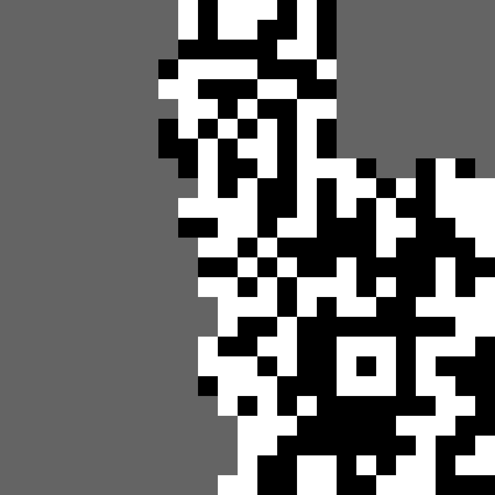
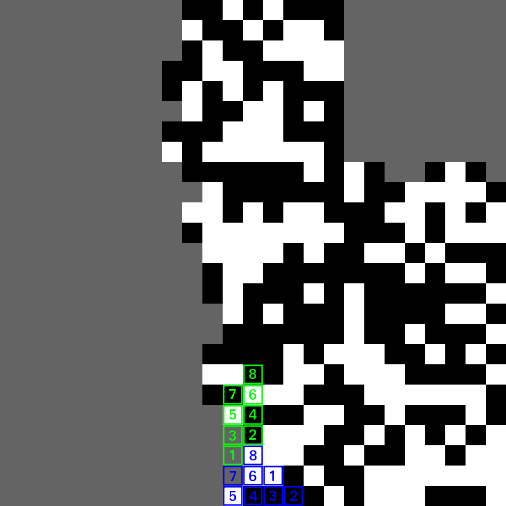

# N-95 [misc]

- Score: 392
- Solves: 79

## Problem

An image is given:


Problem description:

```
QR codes wear masks and so should you.
```

## Solution

Firstly, I converted the image to make it easier to read by using ImageMagick and [this code](convert.py).

```
$ convert N-95.png -shave 80x80 x.png
$ python convert.py
```



We cannot read the mask pattern and most of the error correction information from this image. So, I tried to decode using [strong-qr-decoder](https://github.com/waidotto/strong-qr-decoder) with each mask pattern while ignoring error correction errors.

```
$ git clone https://github.com/waidotto/strong-qr-decoder.git
$ python2 strong-qr-decoder/sqrd.py -m 0 qr.txt
error: 未対応のモード指示子です
$ python2 strong-qr-decoder/sqrd.py -m 1 qr.txt

$ python2 strong-qr-decoder/sqrd.py -m 2 qr.txt
error: 未対応のモード指示子です
$ python2 strong-qr-decoder/sqrd.py -m 3 qr.txt
flag{60_dozen_quartz_japS}
$ python2 strong-qr-decoder/sqrd.py -m 4 qr.txt
error: 未対応のモード指示子です
$ python2 strong-qr-decoder/sqrd.py -m 5 qr.txt
Traceback (most recent call last):
  File "strong-qr-decoder/sqrd.py", line 1054, in <module>
    num = int(data_bits[:11], 2)
ValueError: invalid literal for int() with base 2: ''
$ python2 strong-qr-decoder/sqrd.py -m 6 qr.txt
error: 未対応のモード指示子です
$ python2 strong-qr-decoder/sqrd.py -m 7 qr.txt
Traceback (most recent call last):
  File "strong-qr-decoder/sqrd.py", line 1072, in <module>
    data.append(int(data_bits[:8], 2))
ValueError: invalid literal for int() with base 2: ''
```

I found the mask pattern is 3, and got `flag{60_dozen_quartz_japS}`. However, this flag was judged to be incorrect.

Here, the QR code masked by pattern 3 is:


I took a closer look at the QR code and found that the information with the 24th and 25th characters are broken.



The information with the 24th and 25th characters is as follows:

- 24th character: `0b011100?0`
  - `0b01110000`: `p`
  - `0b01110010`: `r`
- 25th character: `0b?1?10011`
  - `0b01010011`: `S`
  - `0b01110011`: `s`
  - `0b11010011`: `Ó`
  - `0b11110011`: `ó`

Because strings including `Ó` or `ó` are invalid flags, the possible flags are as follows:

- `flag{60_dozen_quartz_japS}`
- `flag{60_dozen_quartz_japs}`
- `flag{60_dozen_quartz_jarS}`
- `flag{60_dozen_quartz_jars}`

I postted `flag{60_dozen_quartz_jars}`, then it was judged to be correct.

## Flag

`flag{60_dozen_quartz_jars}`
